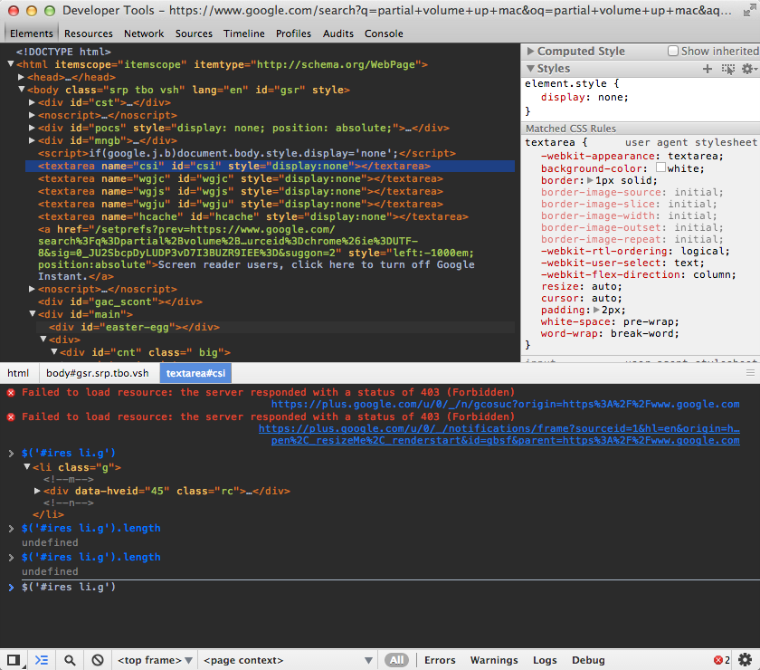
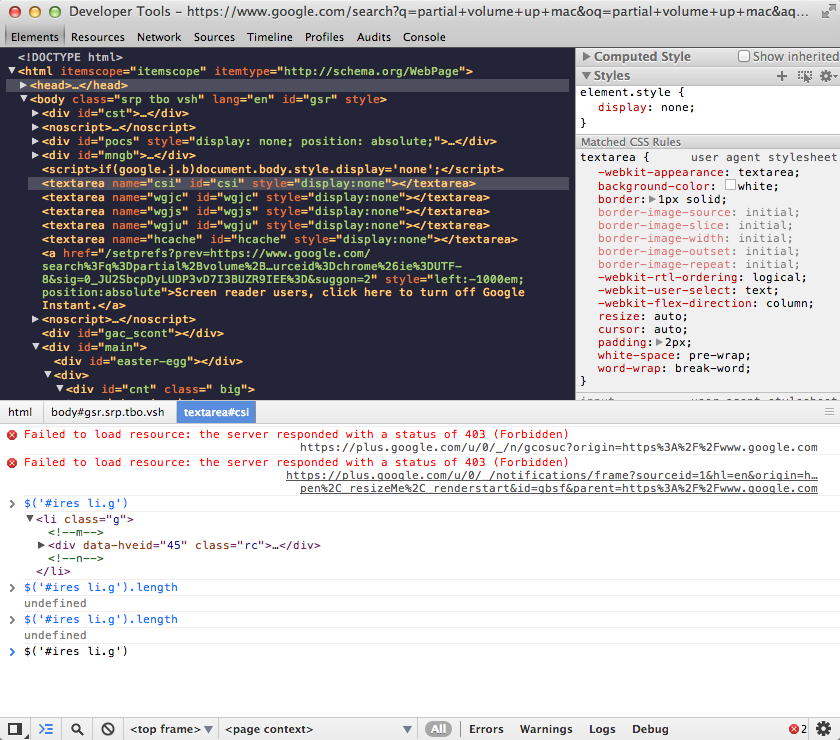

# Chrome Developer Tools Skins

## Description

These are a collection of hand-crafted skins for Chrome Developer Tools.

## Installation

1. Locate the User Stylesheets directory:

    Mac: `~/Library/Application Support/Google/Chrome/Default/User StyleSheets/Custom.css`

    PC: `C:\Users\YourUsername\AppData\Local\Google\Chrome\User Data\Default\User StyleSheets\Custom.css`

    Ubuntu (Chromium): `~/.config/chromium/Default/User StyleSheets/Custom.css`
    
2. Copy the contents of the color theme you want to use.
3. Paste the contents it into the existing `Custom.css` file.

## Screenshots

### Darcula

### Travi

## Resources

* For more information on how to skin Chrome Developer Tools see this [post](http://darcyclarke.me/design/skin-your-chrome-inspector/) by [Darcy Clarke](https://twitter.com/darcy).
* You can use your Chrome Developer Tools to inspect your Chrome Developer Tools skin by:
    1. Undocking Chrome Developer Tools.
    2. With the undocked Chrome Developer Tools in focus, press `Ctrl+Alt+I` on Windows or `⌘⌥I` on Mac to inspect your inspector. Chrome Developer Tools inception!
* Navigate to [`chrome-devtools://devtools/devTools.css`](chrome-devtools://devtools/devTools.css) in your Chrome browser for a full list of available selectors.